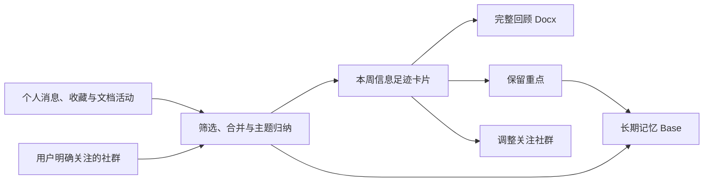

# 飞书个人信息记忆｜产品与模板说明书

> 把散落在飞书消息、收藏、文档和社群里的信息，整理成每周主动送达、可以继续处理的个人记忆。

## 1. 这是什么

“飞书个人信息记忆”是一个面向飞书个人场景的**工作流型模板**，工作流 ID 为 `personal-inbox`。

它不是一张需要用户持续维护的多维表格，也不是单次生成后就结束的静态文档。它会定期读取用户自己的飞书活动与明确关注的社群，从中筛选高信号内容，生成一张“本周信息足迹”互动卡片；需要深入回顾时再进入完整文档，长期数据则沉淀在后台记忆索引中。

一句话概括：

> 每周帮我回答“我最近关注了什么、留下了什么、哪些值得记住”。

当前版本已经完成真实飞书环境验证，可作为本地运行的 MVP 使用。卡片交互目前依赖本地回调监听器，尚未提供云端常驻服务。

## 2. 它解决什么问题

这个模板主要解决两类个人信息管理问题。

### 2.1 只收集，不整理

好的文章可能被发给自己，灵感可能写在文档里，资料可能放进多维表格，重要消息又散落在收藏和群聊中。随着时间变长，用户通常不会记得自己做过哪些信息动作，也很难形成连续的个人认知记录。

### 2.2 加入了社群，却无法持续获得价值

社群消息量大、信噪比不稳定。打开通知会被打扰，开启免打扰后又容易错过精选文档、活动和主题分享。模板不会默认扫描所有群聊，而是只观察用户明确选择的社群，并仅保留具备信息载体或活动信号的内容。

## 3. 模板最终是什么形态

模板由三个相互衔接的层级组成：

| 层级 | 用户看到什么 | 主要作用 |
| --- | --- | --- |
| 每周信息足迹卡片 | 主动发送到个人飞书会话的 Card 2.0 消息 | 快速浏览本周主题、个人足迹、社群发现和跨来源连接 |
| 完整回顾页 | 按主题组织的飞书 Docx 文档 | 阅读完整条目、来源和上下文 |
| 长期记忆索引 | 后台飞书多维表格 Base | 增量去重、状态管理、重点沉淀和长期检索 |



设计原则是：**卡片负责送达和决策，文档负责阅读，Base 负责记忆。**

## 4. 每周信息足迹卡片

卡片是模板的主展示形态，不是 Base 的通知入口。

### 4.1 卡片内容

一张完整卡片包括：

- 本周主要关注：最多展示 5 个主题；
- 数据概览：个人足迹数量、社群发现数量和社群来源数量；
- 我的足迹：展示本周最有代表性的个人行为；
- 社群发现：展示关注社群中的高信号内容；
- 本周连接：说明个人主动关注与社群内容之间出现的共同主题；
- 三个操作入口：查看完整回顾、保留重点、调整关注社群。

当本周没有形成有效记忆时，卡片仍会如实显示空状态，不会用低质量消息填满内容。“保留重点”只有在候选内容已经写入 Base 并绑定记录 ID 后才可用。

### 4.2 三个操作入口

| 操作 | 结果 |
| --- | --- |
| 查看完整回顾 | 打开本周 Docx 回顾页 |
| 保留重点 | 原卡更新为勾选表单，确认后把选中条目标记为长期重点 |
| 调整关注社群 | 原卡更新为群聊选择表单，保存后用于之后的每周同步 |

正式卡片关闭转发，并校验实际操作者必须是卡片所有者，避免他人通过转发或回调修改个人记忆。

## 5. 用户如何使用

### 5.1 首次设置

首次使用需要：

1. 准备一个已经登录的飞书用户 profile；
2. 选择至少一个希望持续关注的社群；
3. 先预览真实数据，确认数据范围；
4. 执行正式同步，自动创建个人信息记忆 Base；
5. 需要卡片交互时启动本地回调监听器。

模板不会在用户未选择的情况下扫描所有群聊。

### 5.2 每周回顾

完成首次设置后，每周流程是：

1. 从上次成功时间继续增量同步，并向前保留 2 小时重叠；
2. 按内容对象合并重复消息、文档和链接；
3. 按信号和主题生成本周回顾；
4. 更新长期 Base，但不覆盖用户手工修改的“处理状态”；
5. 创建完整回顾文档；
6. 将互动卡片发送给用户自己。

首次默认回溯 7 天，可以调整为更长周期。

## 6. 哪些内容会进入记忆

### 6.1 我的足迹

模板会综合以下行为：

- 自己主动发出的消息；
- 收到的私聊与群聊中的直接 @；
- 当前收藏的消息；
- 自己编辑或评论过的云文档；
- 打开过的文档，仅作为辅助证据。

主动收藏、编辑和评论属于强信号；私聊与群聊 @ 属于直接相关信号。单纯打开某个文档不能独立证明它值得长期保留，因此默认只作辅助判断。

### 6.2 社群发现

社群内容需要同时满足两个条件：

1. 来自用户明确选择的关注社群；
2. 包含链接、文件、简报、报名、直播、分享会或其他明确的信息载体与活动信号。

用户可以通过 `community_keywords` 补充自己的关注关键词，但关键词不会绕过社群白名单。

### 6.3 明确不做的事情

- 不默认读取所有加入的群聊；
- 不把普通闲聊全部写入 Base；
- 不声称完整记录了所有“已读消息”；
- 不下载消息附件或复制整篇私密内容；
- 不自动替用户退群、取消免打扰或修改群设置；
- 不覆盖用户手工维护的归档状态。

飞书目前没有个人级逐消息已读历史接口，因此本模板不会把缺失的数据伪装成完整行为记录。

## 7. “保留重点”如何工作

点击“保留重点”后，原周报卡会更新为一个 Card 2.0 勾选表单。

- 候选最多 9 条：4 条个人足迹、5 条社群发现；
- 默认不勾选新内容；
- 已经保留的内容会显示为选中且不可取消；
- 至少选择 1 条新内容才可提交；
- 成功后写入 `是否重点` 和 `保留时间`；
- 成功卡提供“查看重点库”和“查看完整回顾”入口；
- 取消会恢复原周报卡；
- 写入失败会保留当前选择并允许重试。

这个动作只负责**新增重点**，不负责撤销重点。撤销或重新整理可以在长期记忆 Base 中进行。

## 8. “调整关注社群”如何工作

点击“调整关注社群”后，原卡会更新为群聊勾选表单。

- 展示当前关注的社群和近期活跃普通群聊；
- 当前已关注社群优先显示；
- 候选最多 15 个；
- 必须至少保留 1 个关注社群；
- 保存后，群聊 ID 和名称会按 profile 写入本地配置；
- 后续运行无需重复传入 `community_chat_ids`。

这一功能调整的是“模板以后观察哪些社群”，不会修改飞书群本身，也不会改变群通知设置。

## 9. 长期记忆 Base

首次正式执行时，模板自动创建个人信息记忆 Base；之后复用同一 Base 增量更新。

默认视图包括：

- 全部记忆；
- 我的足迹；
- 社群发现；
- 待确认；
- 主动记忆；
- 保留重点。

Base 记录包含活动时间、行为、收件区、信号强度、主题、来源、摘要、证据 ID、事件键、处理状态、是否重点和保留时间等信息。

“事件键”用于增量去重；同一内容对象再次出现时会更新已有记录，而不是不断生成重复行。系统同步不会覆盖用户人工修改的“处理状态”。

## 10. 安装与调用

### 10.1 安装 Agent Skill

当前验证分支：

```bash
npx skills add "MondayLabOS/larkwing-cli#codex/personal-memory-template" \
  --skill larkwing-cli \
  --agent '*' \
  --global \
  --yes
```

查看模板是否已经可发现：

```bash
npx --yes "github:MondayLabOS/larkwing-cli#codex/personal-memory-template" \
  workflow show personal-inbox \
  --json
```

### 10.2 检查飞书身份

```bash
larkwing auth status --profile <profile> --json
```

模板始终使用用户身份读取个人资源，不会在用户身份不可用时偷偷降级为机器人身份。

### 10.3 预览真实数据

预览会读取真实活动并生成结果，但不会写入 Base、创建文档或发送卡片。

```bash
larkwing run "生成本周信息足迹" \
  --workflow personal-inbox \
  --profile <profile> \
  --set community_chat_ids="oc_xxx,oc_yyy" \
  --with-live-data \
  --json
```

### 10.4 正式同步并发送卡片

```bash
larkwing run "生成本周信息足迹" \
  --workflow personal-inbox \
  --profile <profile> \
  --set community_chat_ids="oc_xxx,oc_yyy" \
  --set deliver_review=true \
  --execute \
  --json
```

首次完成社群设置后，后续命令可以省略 `community_chat_ids`。

### 10.5 启动卡片回调监听

在飞书开发者后台为对应应用启用 `card.action.trigger`，然后在用户操作卡片期间保持监听器在线：

```bash
larkwing memory listen \
  --profile <profile> \
  --max-events 2 \
  --timeout 10m \
  --json
```

一次完整的“打开表单并确认/取消”通常产生 2 个事件。监听器退出后卡片仍可阅读，但交互按钮不会自动处理。

## 11. 可配置参数

| 参数 | 是否必需 | 默认值 | 作用 |
| --- | --- | --- | --- |
| `community_chat_ids` | 首次必需 | 无 | 关注社群的 chat ID，多个值用英文逗号分隔 |
| `lookback_days` | 否 | `7` | 首次同步回溯天数 |
| `community_keywords` | 否 | 空 | 补充社群筛选关键词 |
| `deliver_review` | 否 | `false` | 是否创建回顾页并发送卡片 |
| `review_parent_token` | 否 | 个人文档库 | 完整回顾页的父文件夹或 Wiki 节点 |
| `memory_home_url` | 否 | 空 | 长期记忆主页入口 |
| `community_settings_url` | 否 | 空 | 外部社群设置页；留空使用卡片内置调整功能 |

## 12. 权限、隐私与安全

### 12.1 权限原则

- 个人消息、收藏、文档和 Base 操作使用飞书用户身份；
- 卡片事件由机器人长连接消费，再以用户身份更新个人 Base；
- 缺少权限时返回增量授权提示，不自动扩大授权范围；
- 多账号必须显式使用不同的 `--profile`。

### 12.2 本地状态

下列信息保存在项目的 `.larkwing/` 目录：

- Base token 与表格 ID；
- 最近一次成功同步时间；
- 关注社群 ID 与名称；
- 卡片回调状态与原卡快照。

`.larkwing/` 已被 Git 忽略，不会进入提交或安装包。不同 profile 使用独立配置，不会共用 Base 或同步游标。

### 12.3 交互安全

- 正式卡片关闭转发；
- 回调会校验操作者是否为卡片所有者；
- “保留重点”只接受当前卡片绑定的候选记录 ID；
- 回调事件按 `event_id` 去重，避免重复提交；
- 旧卡缺少安全绑定时不会直接写入数据。

## 13. 当前版本的边界

当前版本适合个人或小范围测试使用，但仍有以下边界：

- 卡片交互依赖前台 CLI 长连接，关闭监听器后按钮不会被处理；
- 尚未部署云端常驻回调服务；
- 尚未提供自动定时调度，需要由 Agent、自动化任务或用户主动触发每周同步；
- 社群价值判断基于规则、信号和主题归纳，不能保证每条推荐都符合个人偏好；
- 受飞书接口能力限制，不能还原完整的逐消息阅读历史；
- 当前“保留重点”只新增标记，不在卡片中撤销重点。

这些限制不会影响卡片阅读、完整回顾和 Base 增量同步，但会影响无人值守和长期自动运行体验。

## 14. 什么算使用成功

可以用以下标准判断模板是否真正产生价值：

- 用户每周愿意打开卡片，而不是把它当作新的通知噪音；
- 用户能在 5 分钟内说清本周主要关注和信息来源；
- 至少有一部分内容通过“保留重点”进入长期记忆；
- 关注社群数量可控，并能通过卡片持续调整；
- Base 中重复记录保持可控，人工处理状态不被系统覆盖；
- 一段时间后，用户可以回看自己持续关注过的主题，而不是重新搜索散落信息。

## 15. 常见问题

### 为什么不把多维表格作为主界面？

因为用户的问题不是“缺少一个新的存档位置”，而是缺少主动回顾和后续决策。Base 更适合承担后台记忆和检索，卡片更适合作为每周入口。

### 为什么按钮显示“目标回调服务当前未在线”？

当前版本使用本地长连接处理卡片事件。请启动 `larkwing memory listen`，确认出现 `ready event_key=card.action.trigger` 后，再点击最新发送的卡片。

### 为什么“保留重点”不可用？

本周没有有效候选，或者候选尚未成功同步到 Base 并绑定记录 ID。完成一次成功的正式同步并发送新版卡片后即可使用。

### 调整关注社群会退群或修改免打扰吗？

不会。它只更新模板自己的社群观察清单。

### 为什么没有收录我看过的所有消息？

模板只使用飞书目前可稳定获取的主动、直接相关和辅助行为信号；飞书未提供完整的个人逐消息已读历史。

## 16. 项目入口

- 工作流定义：`workflows/personal-inbox.json`
- 同步、回顾与卡片：`src/personalInbox.ts`
- 卡片回调交互：`src/personalMemoryCallbacks.ts`
- Agent Skill：`skills/larkwing-cli/SKILL.md`
- 自动化测试：`tests/personal-memory-callbacks.test.mjs`

团队评审分支：<https://github.com/MondayLabOS/larkwing-cli/tree/codex/personal-memory-template>
